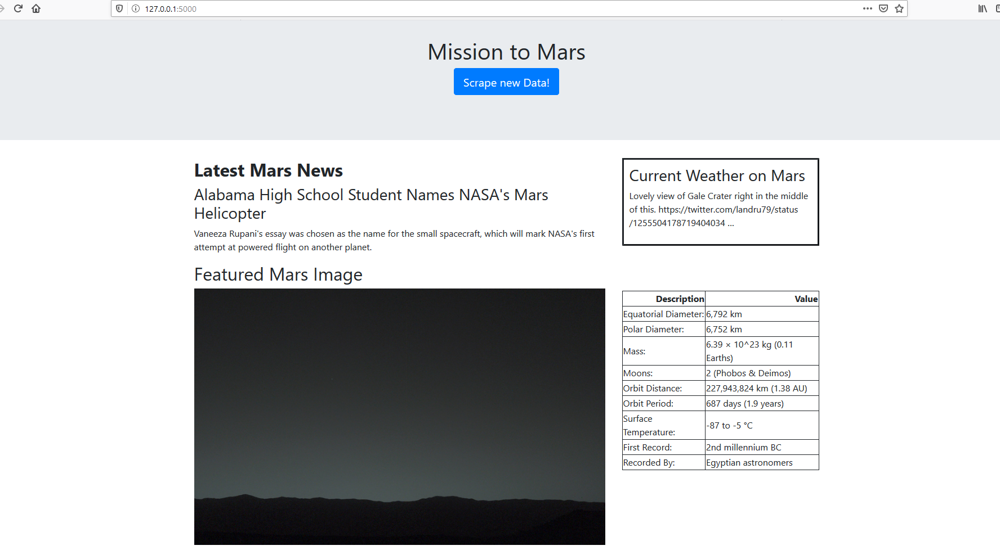
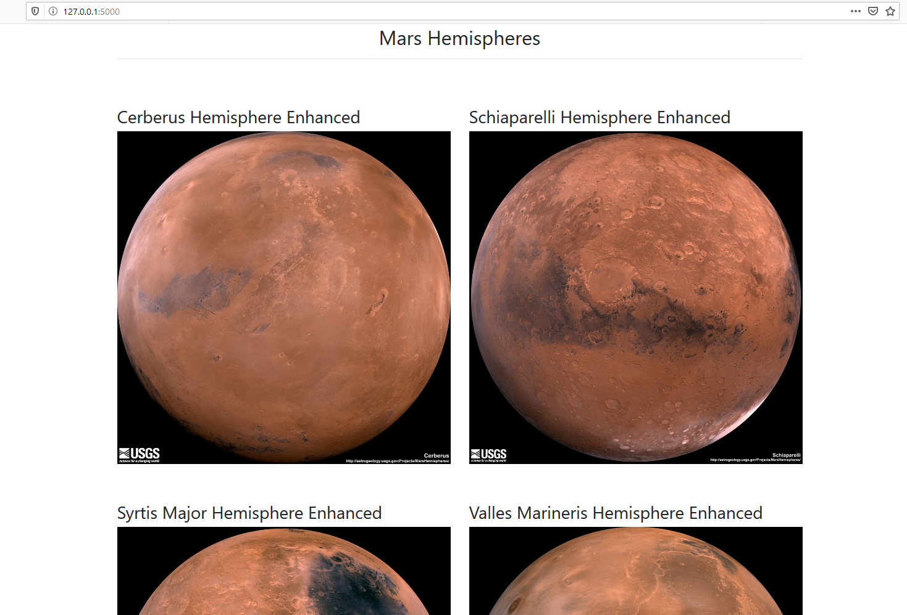

# web-scraping-challenge

Thank you for viewing my mission to mars repo! This was my first attempt at web scraping. The goal of the app is scrape 5 different sources on different Mars facts and to display them in a consumable format. 

Missions_to_Mars directory contains everything needed to run the app. Once there you are able to run app.py which will bring up browser and you should see the website. Go ahead and click Scrape New Data to get started learning about Mars!

# app.py
The main app you should run.

# chromedriver
Tool used to navigate and scrape data from multiple websites

# mission_to_mars.ipynb
Initial code to build and scrape data, later converted into a single script that the app.py can use to scrape it all at once.

# scrape_mars.py
Consolidated code from mission_to_mars to scrape mars data.

# /templates/index.html
Main page for scraping and displaying fun Mars facts and pictures!

# /static/style.css
Stylesheet to help with website formatting.
